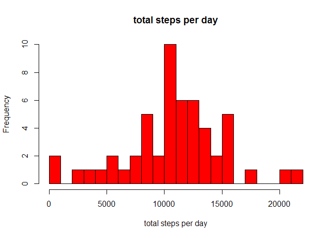
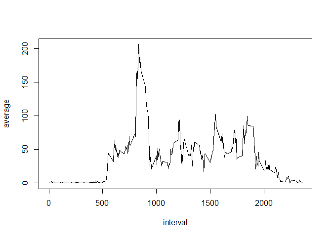
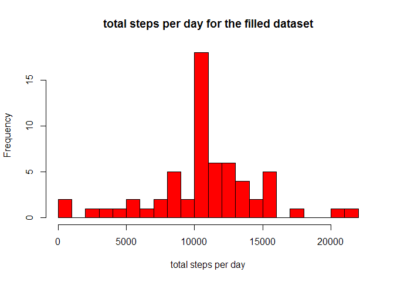
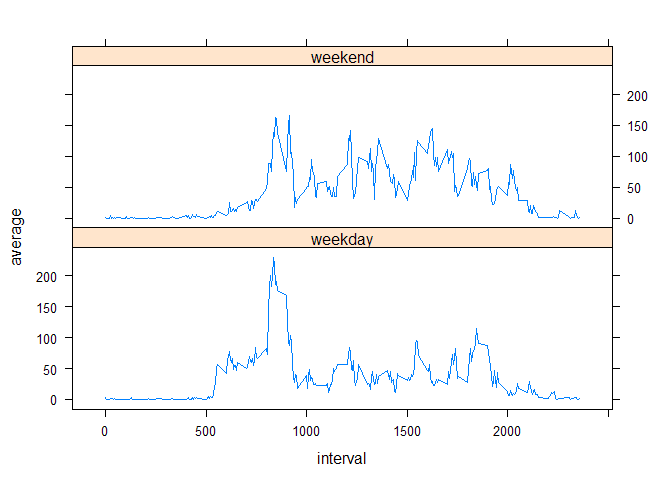

# Reproducible Research: Peer Assessment 1

## Set global options

```r
library(knitr)
opts_chunk$set(echo=TRUE,fig.path="./figure/")
```

## Loading and preprocessing the data

```r
setwd("E:/statistics/coursera/repository/reproducibleresearch/project1")
data<-read.csv("activity.csv")
str(data)
```

```
## 'data.frame':	17568 obs. of  3 variables:
##  $ steps   : int  NA NA NA NA NA NA NA NA NA NA ...
##  $ date    : Factor w/ 61 levels "2012-10-01","2012-10-02",..: 1 1 1 1 1 1 1 1 1 1 ...
##  $ interval: int  0 5 10 15 20 25 30 35 40 45 ...
```

```r
data$date<-as.Date(as.character(data$date),"%Y-%m-%d")
str(data)
```

```
## 'data.frame':	17568 obs. of  3 variables:
##  $ steps   : int  NA NA NA NA NA NA NA NA NA NA ...
##  $ date    : Date, format: "2012-10-01" "2012-10-01" ...
##  $ interval: int  0 5 10 15 20 25 30 35 40 45 ...
```

## What is mean total number of steps taken per day?
Remove the NA values

```r
library(dplyr)
```

```
## 
## Attaching package: 'dplyr'
## 
## The following objects are masked from 'package:stats':
## 
##     filter, lag
## 
## The following objects are masked from 'package:base':
## 
##     intersect, setdiff, setequal, union
```

```r
group_by_day<-group_by(data,date)
totalsteps_perday<-summarize(group_by_day,total=sum(steps))
totalsteps_perday<-totalsteps_perday[!is.na(totalsteps_perday$total),]
hist(totalsteps_perday$total,col="Red",breaks=30,main="total steps per day",xlab="total steps per day")
```

 

```r
mean1<-mean(totalsteps_perday$total)
median1<-median(totalsteps_perday$total)
```
The mean of the total number of steps taken per day is 1.0766189\times 10^{4}  
The median of the total number of steps taken per day is 10765

## What is the average daily activity pattern?

```r
group_by_interval<-group_by(data,interval)
averagesteps_perinterval<-summarize(group_by_interval,average=mean(steps,na.rm=TRUE))
with(averagesteps_perinterval,plot(interval,average,type="l"))
```

 

```r
max_interval<-averagesteps_perinterval$interval[averagesteps_perinterval$average==max(averagesteps_perinterval$average)]
```
The 835 interval,on average across all the days in the dataset,contains the maxium number of steps.

## Imputing missing values
Fill in all of the missing values in the dataset with the mean for that 5-minute interval.

```r
number<-sum(is.na(data$steps))
n<-nrow(data)
filleddata<-data
for(i in 1:n){
    if(is.na(filleddata$steps[i])){
        interval_index<-filleddata$interval[i]
        filleddata$steps[i]<-averagesteps_perinterval$average[averagesteps_perinterval$interval==interval_index]
    }
}
group_by_day_filled<-group_by(filleddata,date)
totalsteps_perday_filled<-summarize(group_by_day_filled,total=sum(steps,na.rm=TRUE))
hist(totalsteps_perday_filled$total,breaks=30,col="Red",main="total steps per day for the filled dataset",xlab="total steps per day")
```

 

```r
mean2<-mean(totalsteps_perday_filled$total,na.rm=TRUE)
median2<-median(totalsteps_perday_filled$total,na.rm=TRUE)
```
There are 2304 NA values in the dataset.The mean of the total number of steps taken per day is 1.0766189\times 10^{4}, the median of the total number of steps taken per day is 1.0766189\times 10^{4}. The mean remains the same as that of the first part of assignment,while the median increases a little bit. The estimate of the total daily number of steps does not change after filling in all the missing values with the mean for that 5-minute interval.

## Are there differences in activity patterns between weekdays and weekends?

```r
filleddata$weekday<-as.POSIXlt(filleddata$date)$wday
for(i in 1:length(filleddata$weekday)){
    if(filleddata$weekday[i]==0|filleddata$weekday[i]==6){
        filleddata$weekday[i]<-"weekend"
    }else{
        filleddata$weekday[i]<-"weekday"
    }
}
filleddata$weekday<-factor(filleddata$weekday)
group_by_weekday<-group_by(filleddata,interval,weekday)
average_across_weekday<-summarize(group_by_weekday,average=mean(steps,na.rm=TRUE))
library(lattice)
xyplot(average~interval|weekday,data=average_across_weekday,layout=c(1,2),type="l")
```

 

